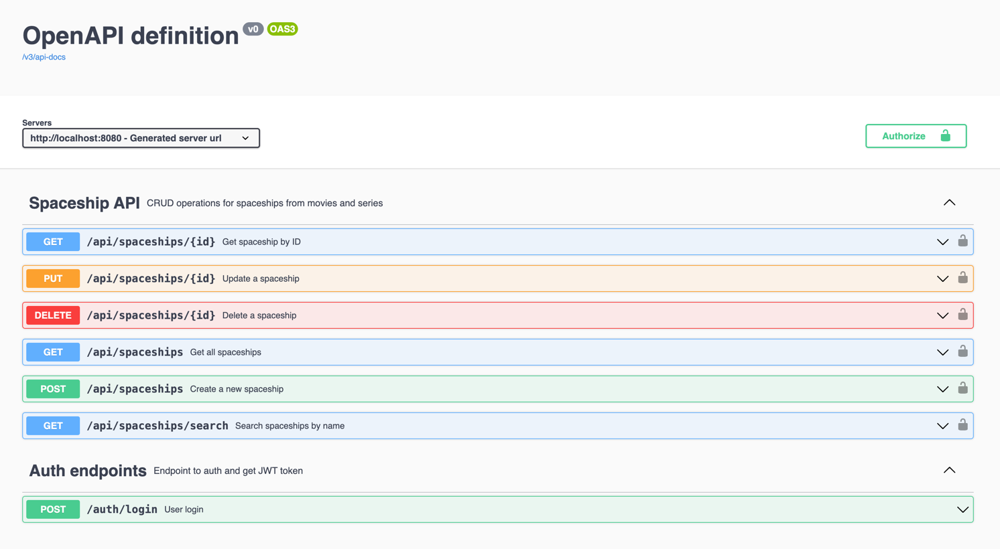
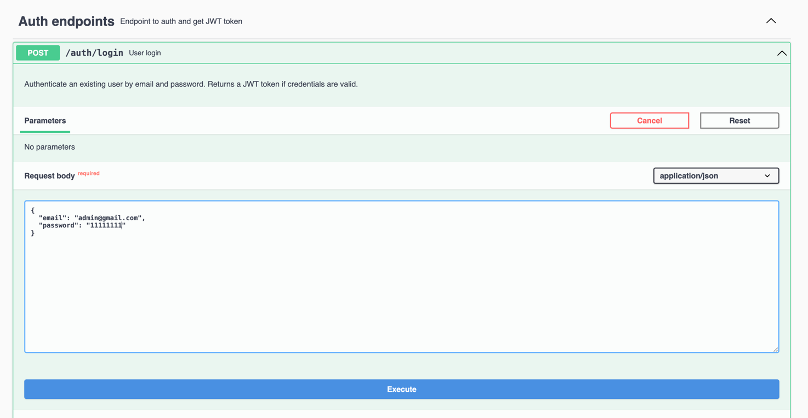
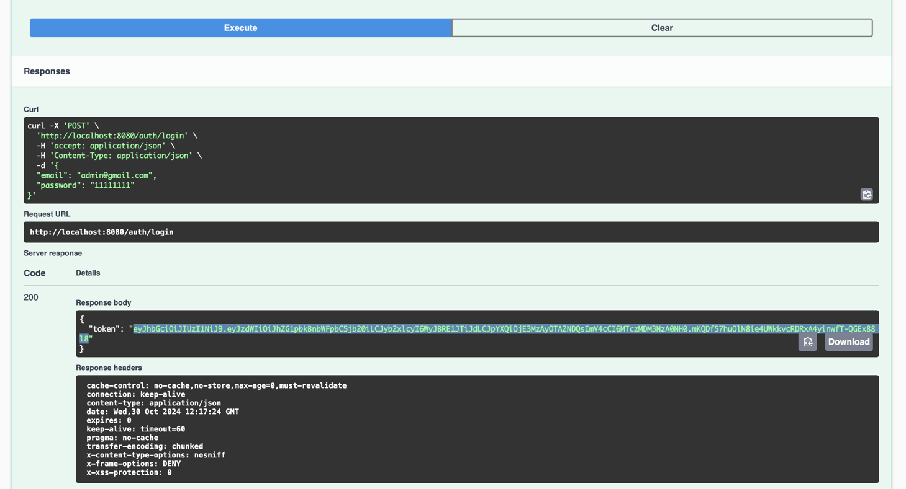
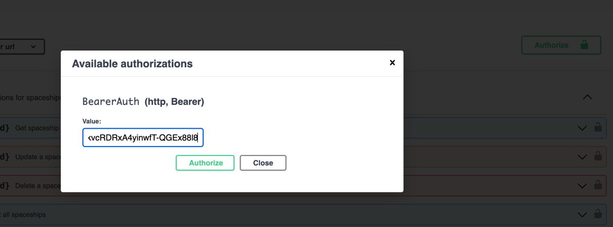
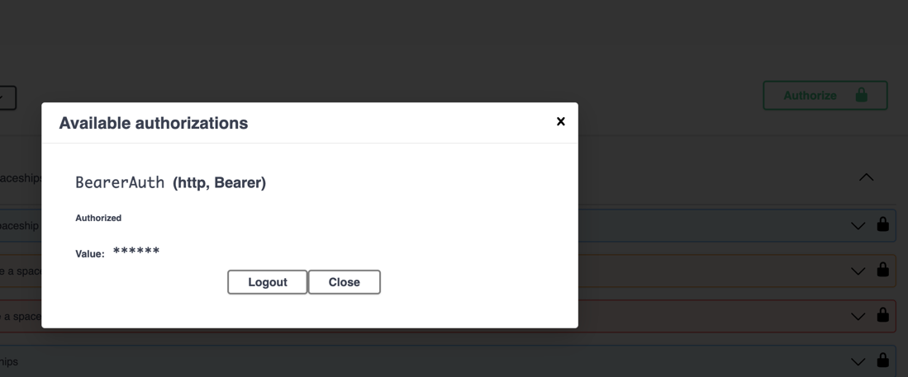

# 🚀 **Spaceship Management API**

## **Overview**

This API enables the management of spaceships, with features such as **user authentication**, **spaceship CRUD operations**, and **admin-specific capabilities**.

## **Requirements**

- **Java**: JDK 21
- **Maven**
- **Docker**

## **Dependencies**

The application uses:
- **Spring Boot**: v3.3.5
- **Spring Boot** for REST, JPA, and security
- **PostgreSQL** as the primary database
- **Redis** for caching
- **Kafka** for message streaming
- **OpenAPI** for API documentation
- **Liquibase** for db merging
- **JWT(jjwt)** for JWT authentication

## **Getting Started**
### **Docker setup**
#### Run next command via terminal: 
- `docker-compose -f docker-compose.dev.yml up --build -d`

**Spring Boot API, Kafka, Redis, Postgres will be started** in Docker containers

### Check Open API documentation via browser 
`http://localhost:8080/swagger-ui/index.html#`

## API Endpoints
User Authentication (Located at /auth):
- POST **/auth/login**: User login, returns a JWT token.

Spaceship Management (Located at /api/spaceships):
- GET **/api/spaceships**: Retrieve all spaceships.
- GET **/api/spaceships/{id}**: Get a spaceship by ID.
- GET **/api/spaceships/search?name={name}**: Search for spaceships by name.
- POST **/api/spaceships**: Create a new spaceship (Admin only).
- PUT **/api/spaceships/{id}**: Update a spaceship by ID (Admin only).
- DELETE **/api/spaceships/{id}**: Delete a spaceship by ID (Admin only).

### Enter as admin:
- email:    `admin@gmail.com`
- password: `11111111`

### Enter as user:
- email:    `user@gmail.com`
- password: `11111111`

#### Full view of available endpoints:

#### Login endpoint overview:

#### Login token response overview:

#### Authorize bottom overview:

#### Once you put the token inside should see:

## How to run tests on this application

Feel free to use **TestDataHelper class** for static parameters inside test methods. 

#### To run integration tests steps:

- run: `mvn test -Dspring.profiles.active=test`

